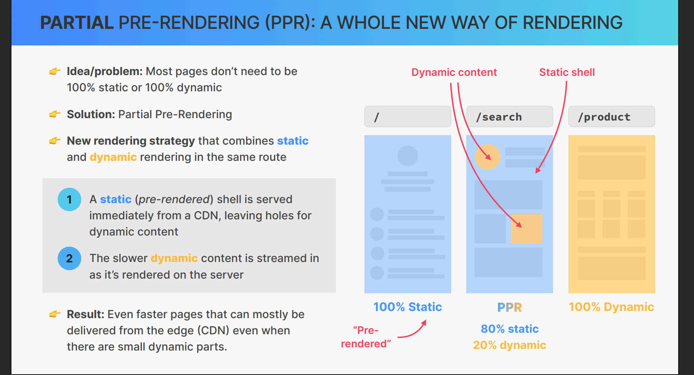
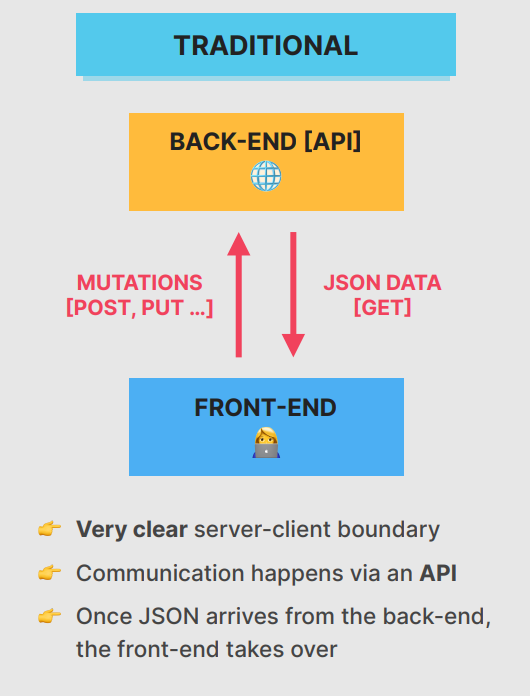
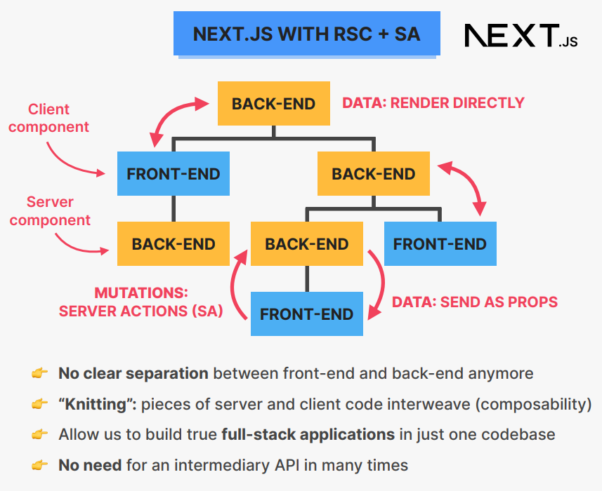
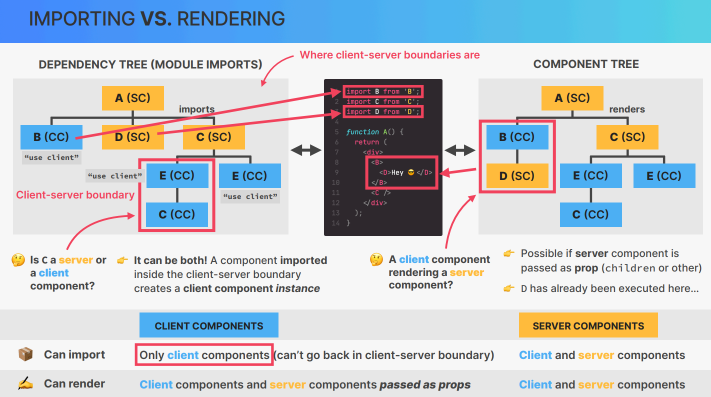

## Getting Started

# Lecture: 456

### Static Site Generation (SSG)

Static Site Generation allows us to deploy our website on any server, where it functions like a regular HTML site. However, a key challenge arises with image optimization. The **Image** tag in Next.js relies on Vercel's server for optimization. If we deploy the static site on a different server, the **Image** tag will not work, and images will not render properly. In short, we lose the ability to optimize images using Next.js's built-in functionality. Additionally, even on the Vercel server, we need to use the standard `` tag for image rendering instead of the **Image** tag.

**Note:** The **Image** tag in Next.js is essentially an API for image optimization.

### Updating the Next.js Configuration

To enable SSG, we need to make changes to the `next.config.js` file as follows:

```javascript
import type { NextConfig } from "next";

const nextConfig: NextConfig = {
  /* Add your configuration options here */
  images: {
    remotePatterns: [
      {
        protocol: "https",
        hostname: "",
        port: "",
        pathname: "/storage/v1/object/public/cabin-images/**",
        search: "",
      },
    ],
  },
  output: "export", // Required for SSG
};

export default nextConfig;
```

#### [NEXT JS DOCUMENTAION](https://nextjs.org/docs/pages/building-your-application/deploying/static-exports)

This configuration will generate an **out** folder containing all the static files, which can be deployed anywhere. However, it's important to ensure that all components are Server-Side Rendered (SSR) components.

### Running the Development Server

After updating the configuration, run the following command:

```bash
npm run dev
```

### Optimizing Images on Non-Vercel Servers

If you still want to optimize images while hosting on a non-Vercel server, you can use third-party image optimization services like [Cloudinary](https://cloudinary.com).

<br/>
<br/>

# 457. Partial Pre-Rendering

> 👋 As of Next.js 14, **PPR is highly experimental** and should not be used in production.

- PPR needs to be turned on in config file

- By default, as much as possible of any route will be statically rendered, creating a static shell
  Dynamic parts (components) should be placed inside Suspense boundaries

* There are no new APIs to learn

* These boundaries tell Next.js that anything within the boundary is dynamic

* The boundary prevents the dynamic part (e.g. reading a header or making a non-cached fetch
  request) from spreading onto the entire route.

* We provide a static fallback to be shown while the dynamic part is rendering
  Dynamic components or sub-trees are inserted into the static shell as they become available


<br/>
<br/>
<br/>

# 458. How Next.js Caches Data

> **Note**: 👋 This behavior applies to **production** mode. Caching doesn’t work in development.

### [Next.js Documentation](https://nextjs.org/docs/app/building-your-application/caching)

### [Udemy Lecture Video](https://www.udemy.com/course/the-ultimate-react-course/learn/lecture/43783788)

---

### Types of Caching in Next.js

#### 1. **Request Memoization**

- Happens on the `server` side.
- When the same data is requested with the same payload on an **API**, React handles the memoization.

#### 2. **Data Cache**

- Occurs on the `server` side.
- When multiple users request the same static data, the Next.js server serves the same cached data to everyone.
- Benefits: Improves **cost-efficiency** and **speed**.
- **Note**: Cache does not clear on **re-deploy**.

#### 3. **Full Route Cache**

- The `server` serves the full static page to all users.
- Cache is cleared when the app is **re-deployed**.

#### 4. **Route Cache**

- Happens on the `client` side (e.g., browser back button).
- Works for both **static** and **dynamic** components:
  - **Dynamic components**: Cached for `30 seconds`.
  - **Static pages**: Cached for `5 minutes`.
- **Note**: Does not work on a **full/hard reload**.

---

### Important Notes on Caching

> **Note**: 👋 We can controle this behaviour of NEXT JS. For more read doc.

- Next.js caching can sometimes negatively impact the user experience.
- Example:
  - If backend data changes and the user is on a static route, refreshing with the same payload will not trigger a new **API** request due to caching.
  - The cached static page will hold the old data for `5 minutes`.
  - Only after `5 minutes` will the data update upon refresh. 🤦‍♂️
- This behavior can lead to outdated data being displayed to users.

We can stop this by the revalidate variable in next js both for the component level ant the page level
We just need to export a revalidate variable with the `Time in sec` the when ever user refresh the page after the revalidate time data will fetch again this is good if we have huge number of trafic on our website so we dont need to send th req again and again we can defined the time

#### Time base revalidation

```javascript
export const revalidate = 0; //Fetch data on every request
export const revalidate = 60 * 1; //Fetch data on every min
```

For fetch data in component level by **Time base revalidation**

```javascript
import { unstable_store as noStore } from "next/cache";

export default async function CabiniList() {
  noStore();
  const cabins: any = await getCabins();

  if (!cabins.length) return null;
  return (
    <div className="grid sm:grid-cols-1 md:grid-cols-2 gap-8 lg:gap-12 xl:gap-14">
      {cabins.map((cabin: any) => (
        <CabinCard cabin={cabin} key={cabin.id} />
      ))}
    </div>
  );
}
```

> **NOTE**: There is also path base revalidation you can checkout the **`NEXT JS`** documentation.

 <br/>
 <br/>
 <br/>

# **Section 35**: Client server intraction

# 462. Blurring the Boundary Between Server and Client (RSC – Part 4)

#### **Traditional Approach**



#### **Next js with RSC + SA**

> **NOTE**: This process called Knitting.



- SC(**server component**)
- CC (**client component**)

```javascript
NOTE: If we pass a SC component as a chinder props to client component it will as a server component
'use client'
import D from 'D' //Client component
import C from  "C" //Server component


return <D>
           <C/>
        <D>

Then C always work as a server component because we pass C as a chindren and will not cross the boundry on server
```

```javascript
NOTE: If we not pass SC to a client one that i will work as a client component as cross the boundry on server

'use client'
import D from 'D' //Client component
import C from  "C" //Server component


return <div>
           <D/>
           <C/>
        </div>

Now C cross the boundry of the server and become client component
```

```javascript
NOTE: A server component can work as a client and server component at the same time

'use client'
import D from 'D' //Client component
import C from  "C" //Server component


return <div>
           <D>
           <C/> // Still work as a server component
           </D>
           <C/> // not a childrent of client so its becomes client component
        </div>
```


...
